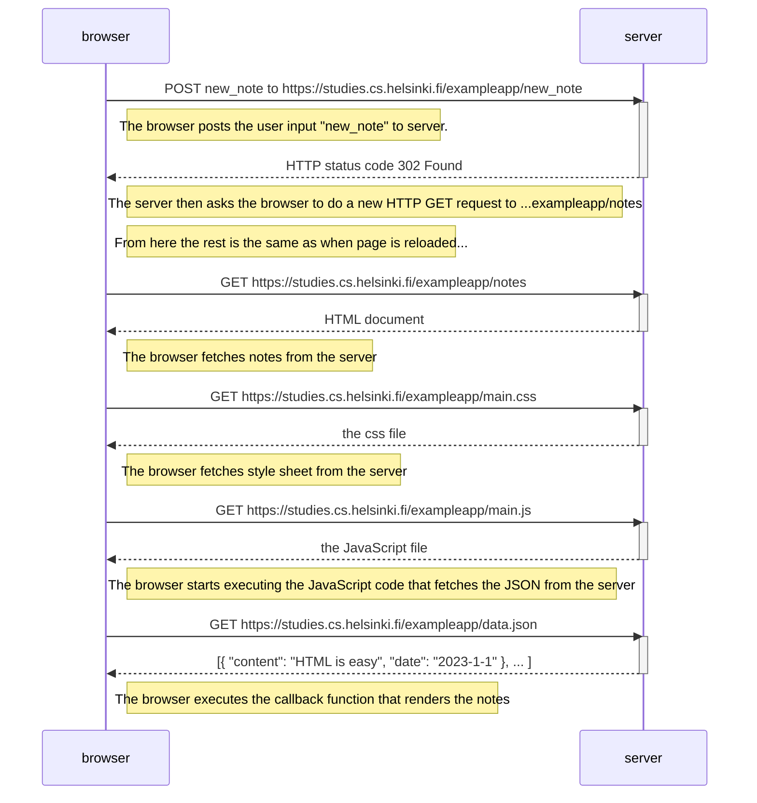

# New note diagram

```mermaid
    sequenceDiagram
        participant browser
        participant server

        
        browser->>server: POST new_note to https://studies.cs.helsinki.fi/exampleapp/new_note
        activate server

        Note right of browser: The browser posts the user input "new_note" to server.

        server-->>browser: HTTP status code 302 Found
        deactivate server

        Note right of browser: The server then asks the browser to do a new HTTP GET request to ...exampleapp/notes


        Note right of browser: From here the rest is the same as when page is reloaded...

        browser->>server: GET https://studies.cs.helsinki.fi/exampleapp/notes
        activate server
        server-->>browser: HTML document
        deactivate server

        Note right of browser: The browser fetches notes from the server

        browser->>server: GET https://studies.cs.helsinki.fi/exampleapp/main.css
        activate server
        server-->>browser: the css file
        deactivate server

        Note right of browser: The browser fetches style sheet from the server

        browser->>server: GET https://studies.cs.helsinki.fi/exampleapp/main.js
        activate server
        server-->>browser: the JavaScript file
        deactivate server

        Note right of browser: The browser starts executing the JavaScript code that fetches the JSON from the server

        browser->>server: GET https://studies.cs.helsinki.fi/exampleapp/data.json
        activate server
        server-->>browser: [{ "content": "HTML is easy", "date": "2023-1-1" }, ... ]
        deactivate server

        Note right of browser: The browser executes the callback function that renders the notes
```
