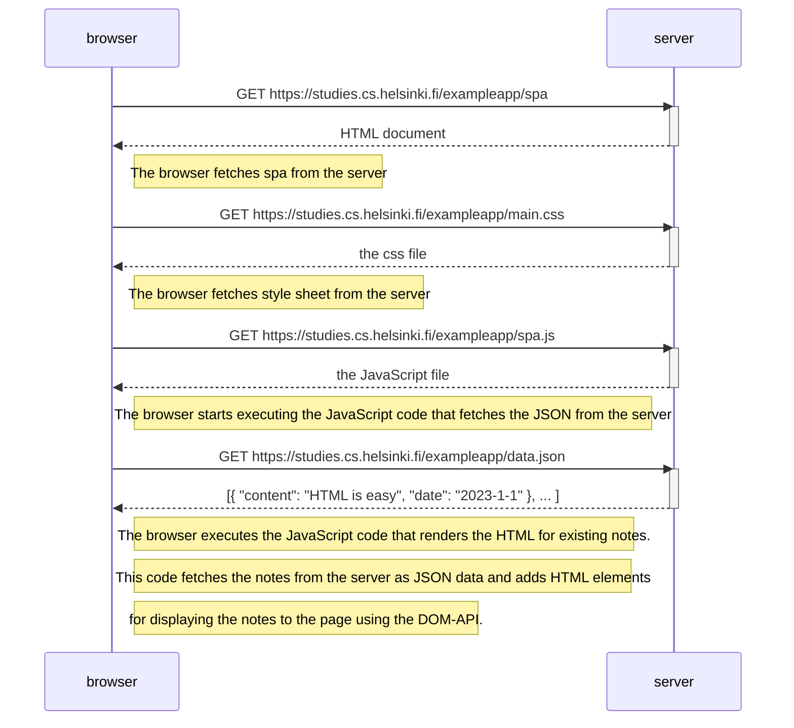

# Single page app diagram

```mermaid
    sequenceDiagram
        participant browser
        participant server

        browser->>server: GET https://studies.cs.helsinki.fi/exampleapp/spa
        activate server
        server-->>browser: HTML document
        deactivate server

        Note right of browser: The browser fetches spa from the server

        browser->>server: GET https://studies.cs.helsinki.fi/exampleapp/main.css
        activate server
        server-->>browser: the css file
        deactivate server

        Note right of browser: The browser fetches style sheet from the server

        browser->>server: GET https://studies.cs.helsinki.fi/exampleapp/spa.js
        activate server
        server-->>browser: the JavaScript file
        deactivate server

        Note right of browser: The browser starts executing the JavaScript code that fetches the JSON from the server

        browser->>server: GET https://studies.cs.helsinki.fi/exampleapp/data.json
        activate server
        server-->>browser: [{ "content": "HTML is easy", "date": "2023-1-1" }, ... ]
        deactivate server

        Note right of browser: The browser executes the JavaScript code that renders the HTML for existing notes.
        Note right of browser: This code fetches the notes from the server as JSON data and adds HTML elements
        Note right of browser: for displaying the notes to the page using the DOM-API.
```