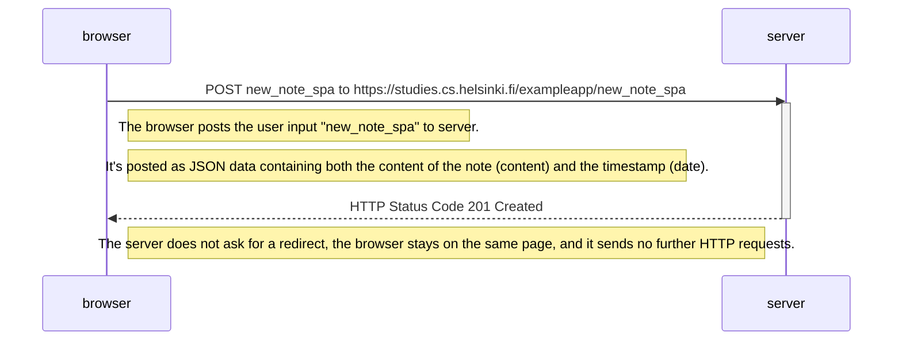

# New note in Single page app diagram

How the SPA version works compared to older version:
The browser does not traditionally send the form data, but instead uses the JavaScript code it fetched from the server.
This code fetches the form element from the page and registers an event handler.
This handler prevents the default handling of form's submit which would be a new GET request.
Then the handler adds a new note to the note list on the page and sends the new note to the server.
